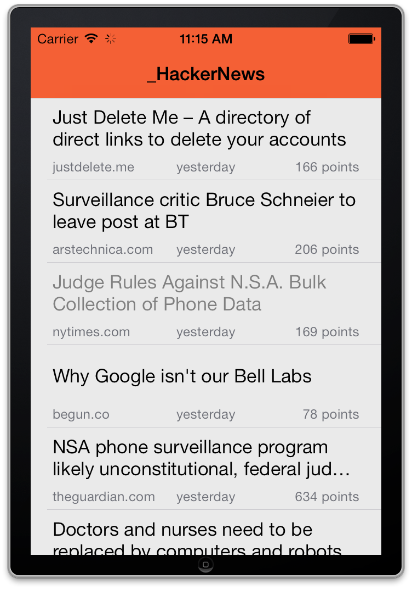
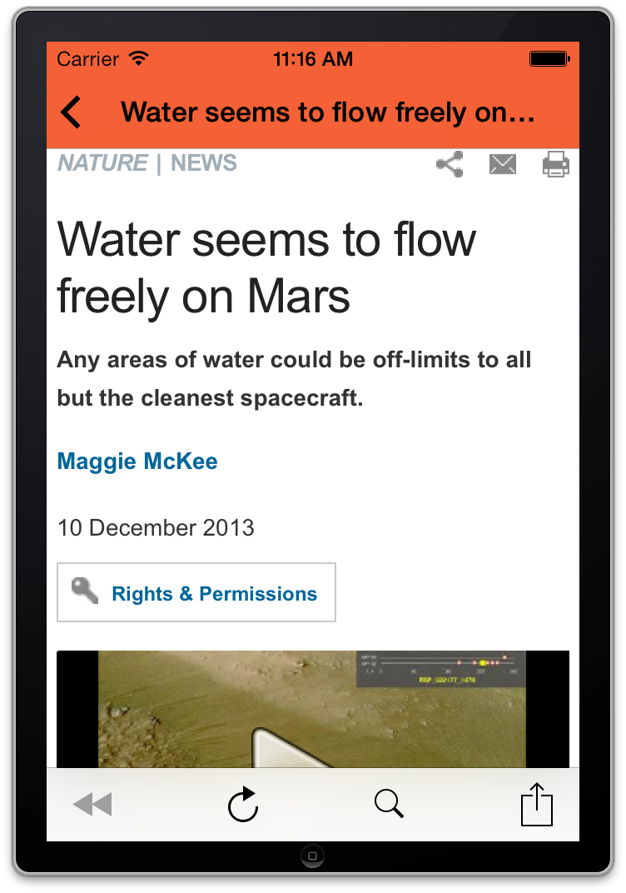
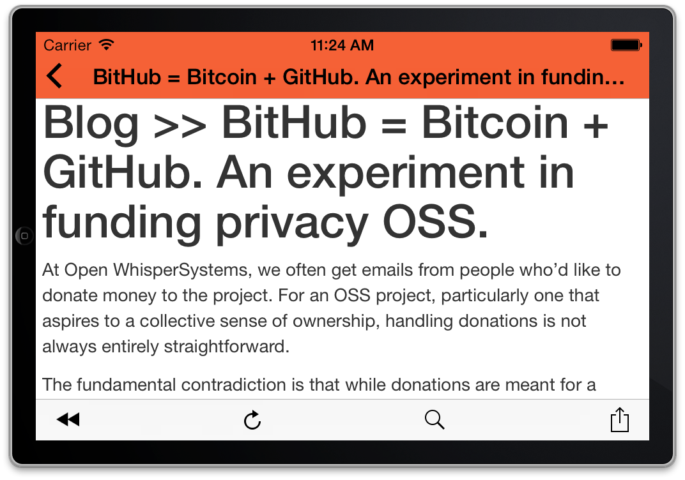

_HackerNews
===========

A simple iOS HackerNews client.

Requires a service, which is implemented in the folder *backend*.
It parses the [Hacker News](https://news.ycombinator.com) front page and stores the links in a JSON, which is accessed by the app.
It also provides a readability view of articles (it uses the php-readability library).

## Screenshots

